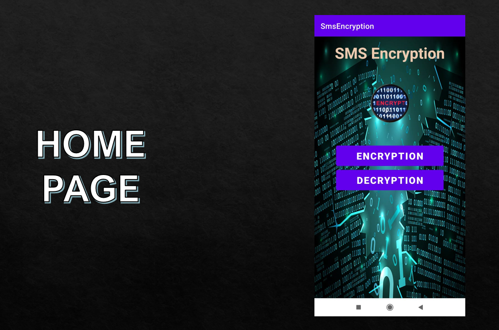
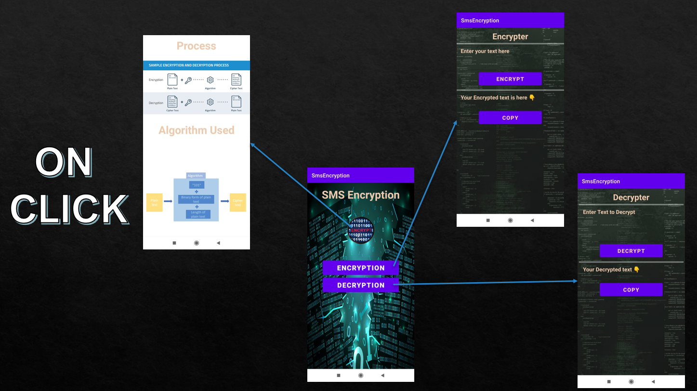
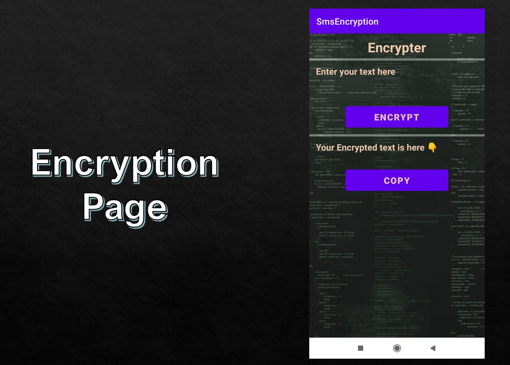
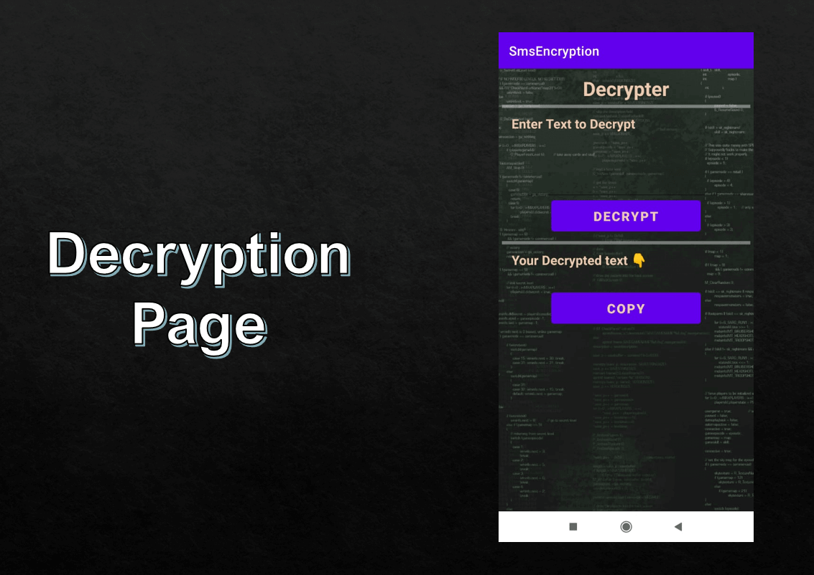

# SMS-Encryption-App
In this project i have created an app to encrypt and decrypt messages using a simple alogithm
## 1. Home Page

On Clicking home page 

## 2. Encryption Page

plain text => chiper text

## 3. Decryption Page

chipher text => plain text

## 4. About Page

## Algorithm used
