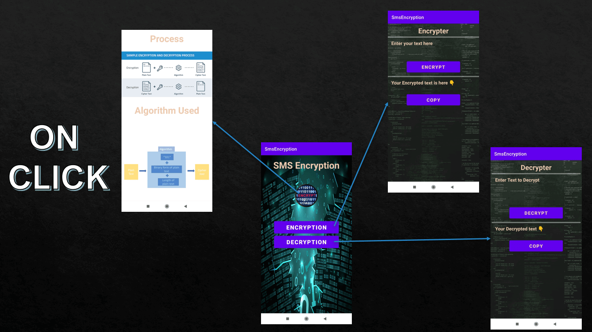

# SMS-Encryption-App
In this project I have created an app to encrypt and decrypt messages using a simple algorithm
## 1. Home Page

On Clicking home page

## 2. Encryption Page

plain text => chiper text

## 3. Decryption Page

chipher text => plain text

## 4. About Page

## Algorithm used

